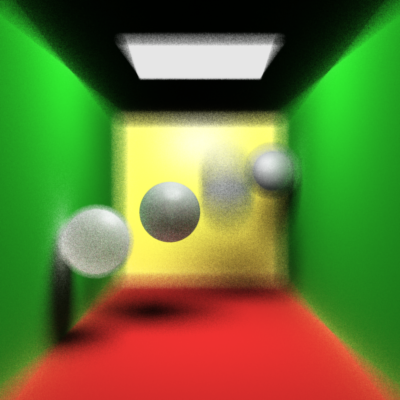

# Monte Carlo Ray Tracing in c++ 



## Table of contents
- [Installation](#Installation)
- [Usage](#Usage)
- [DIY](#DIY)
- [Implementation](#implementation)
    - [Monte Carlo path tracing](#Monte_Carlo_path_tracing)
    - [Mesh acceleration](#Mesh_acceleration)
    - [MPI acceleration](#MPI_acceleration)
    - [Error handling](#Error_handling)
- [License](#License)
- [Acknowledgements](#Acknowledgements)

## Installation
I don't want to force you to have the same configuration with me, but I'm really not sure whether this code can run on your device. If anything is wrong, you can just copy my code and build it in your own way.

**Windows 10 or 11**. I'm not using any kernel function, so I guess Linux or MacOS is fine.

**msmpi** is a Windows implementation of Open MPI, you can install it with **vcpkg**. Or you can use any version of MPI library you want, as long as the interfaces are the same.

**filesystem** is used for finding files inside the project. It seems that I can only use it with c++ 17 or later.

**vcpkg** is a useful tool for installing c++ libraries. I'm not an expert on this, so I always ask AI when I have any problem.

**Visual Studio 2022**. I apologize for the inconvenience it causes for non-VS users. Visual Studio can build my project automatically, that's why I don't have a "build" section in this readme file.

## Usage
For single-process rendering, I always press the **start** button in Visual Studio. 
For multi-process rendering, you can find the .exe file and run

```shell
mpiexec -n <number of processes> .\Graphics
``` 

## DIY

## Implementation
Here are something I want to share with you. You are welcomed to see my code and give me some advice. There are annotations everywhere in my code (although they might not be very professional).

### Monte Carlo path tracing
The most important part is computing reflection rays and sampling light sources.

### Mesh acceleration
In the original version, I intersect a triangle mesh by testing all triangles one by one. This is extremely slow, so special data structure is needed. I choose to use the bounding volume hierarchy(BVH).

#### construction
The construction of BVH is a divide and conquer algorithm. BVH is a binary search tree, I will divide triangles into 2 groups at each node.

First, I compute the bounding box for all triangles inside this node ($O(n)$ time). I sort all triangles according to the center of their bounding box ($(O(\log n))$ time). Then I divide them evenly and recurse this operation. This gives me the following formula for complexity:

$$T(n) = 2T\left(\frac{n}{2}\right) + O(n \log n)$$

According to master's theorem, the total time for constructing a BVH is $O(n \log n)$. For a mesh with 500,000 triangles, this takes roughly 1 second on my computer.

#### intersection
My BVH is a perfect balanced binary search tree. In each node, there is a bounding box that covers all triangles inside this node. This bounding box is computed in the construction stage.

To compute the intersection point, I first test the incoming ray with the bounding box. If no intersection is detected, I can safely return without further computation. If a intersection is detected, we must recurse on all children.

In the worst case we need to traverse the tree, which takes $O(n)$ time. In the best case we can return immediately, which takes $O(1)$ time. This is always better than brute force algorithm.

Kd-tree is not perfectly balanced, but it is smarter. It allows us to recurse only on one child if possible. For BVH we need to recurse on all children, but the depth is likely to be smaller. I choose BVH because the coding is simpler, and the constant coefficient in complexity is smaller.

### MPI acceleration
Using Open MPI to accelerate a program is relatively easy. I just need to let each process compute a small fraction on the image, then merge their results with MPI communications. Considering the small amount of communication involved, I can get linear acceleration ratio.

However, how to split the task is actually a problem. At the beginning I separated the image into strips, but this can lead to unbalanced separation. Some processes run very fast, while others are slow. To get a better separation, I first render the image with a low resolution and count the time consumed for different places on the image. Then I can divide the tasks evenly in time domain, rather than in physical domain.

### Error handling

## License
Please see the [License.txt](License.txt) for more information.

## Acknowledgements
This framework is based on assignments from MIT course 6.837: 
https://ocw.mit.edu/courses/6-837-computer-graphics-fall-2012/

This website provides a lot of 3D sculptures from museums:
https://threedscans.com/

There are lots of high-resolution planet pictures on this website:
https://planetpixelemporium.com