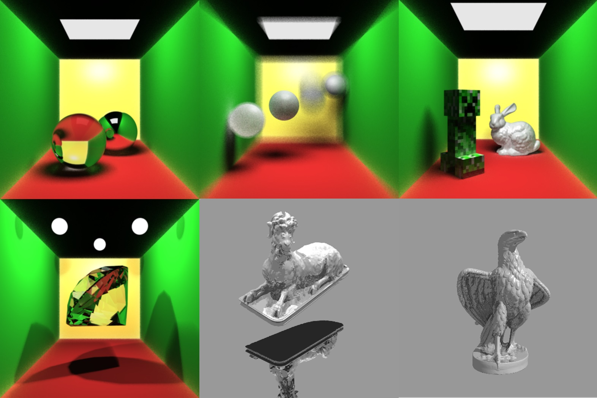
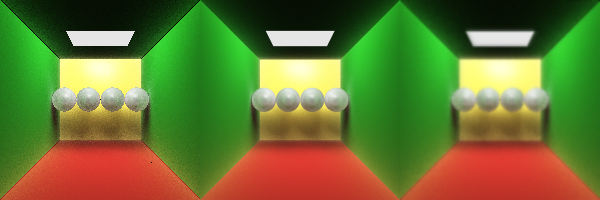
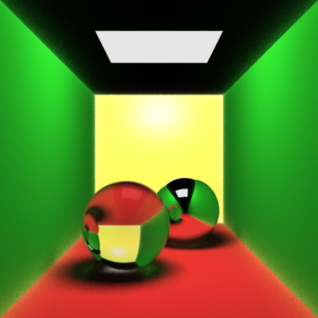
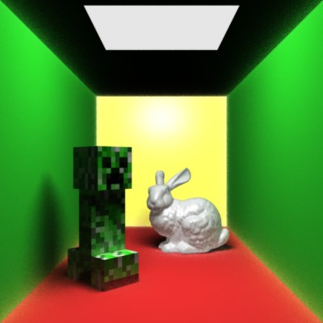
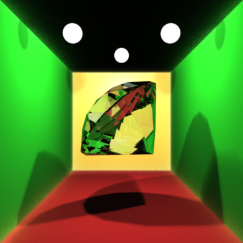
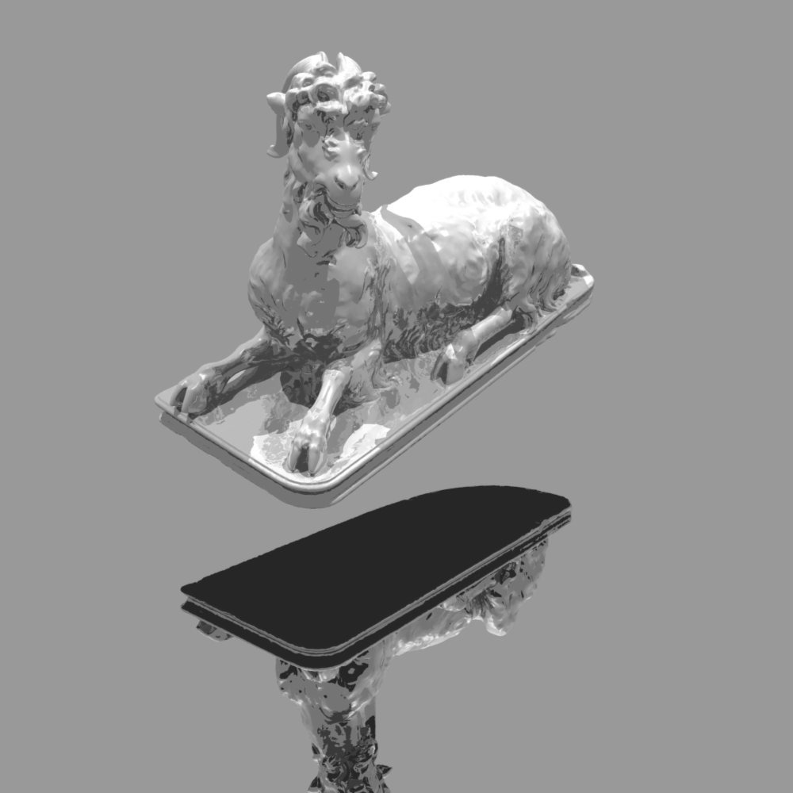
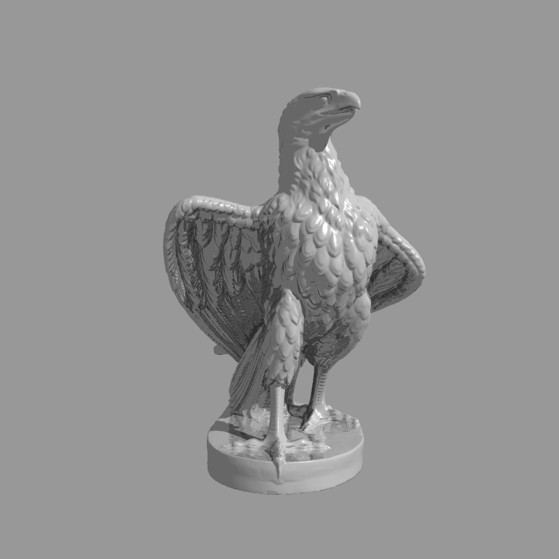

# Monte Carlo Ray Tracing in c++ 



This project implements Monte Carlo ray tracing in c++, accelerated by Open MPI.

## 0. Table of contents
- [Installation](#1-Installation)
- [Usage](#2-Usage)
    - [File structure](#21-File-structure)
    - [Configuration](#22-Configuration)
    - [Execution](#23-Execution)
- [Implementation](#3-implementation)
    - [Monte Carlo path tracing](#31-Monte-Carlo-path-tracing)
    - [Mesh acceleration](#32-Mesh-acceleration)
    - [MPI acceleration](#33-MPI-acceleration)
    - [Anti-aliasing](#34-Anti-aliasing)
- [Error handling](#4-Error-handling)
- [Examples](#5-Examples)
- [License](#6-License)
- [Acknowledgements](#7-Acknowledgements)

## 1. Installation
I don't want to force you to have the same configuration with me, but I'm really not sure whether this code can run on your device. If anything is wrong, you can just copy my code and build it in your own way.

**Windows 10 or 11**. I'm not using any kernel function, so I guess Linux or MacOS is fine.

**msmpi** is a Windows implementation of Open MPI. You can install it with **vcpkg**, or you can use any implementation of MPI.

**filesystem** is used for finding files inside the project. It seems that I can only use it with c++ 17 or later.

**vcpkg** is a useful tool for installing c++ libraries. I'm not an expert on this, so I always ask AI when I have any problem.

**Visual Studio 2022**. This project is built by Visual Studio and does not contain a makefile. I apologize to anti-VS programmers.

## 2. Usage
### 2.1 File structure
To prepare the rendering, please make sure you have these directories in the project: 

```
Graphics
├─input
│  └─in.scene
│  └─...
├─mesh
│  └─model.obj
│  └─...
├─output
│  └─out.bmp
│  └─...
├─texture
   └─converter.py
   └─skin.bmp
   └─...
```

The **.scene** file contains information about the scene, such as position and color of lights and objects.
The **.obj** file contains a 3D model. It can be downloaded from online mesh libraries. You can find a good source in [Acknowledgements](#Acknowledgements).
The format of texture files in "texture/" need to be **.bmp** encoded in RBG values. I have provided [a piece of Python code](texture/converter.py) to convert any image into the correct format.
The program will read in the **.scene** file, parse meshes and textures, then store the result in "output/" as a **.bmp** file.

### 2.2 Configuration
Before running the code, you need to go to the [code/Configuration.hpp](code/Configuration.hpp) and set up suitable parameters, this is the content: 
```c++
#pragma once

//image size
static constexpr int WIDTH = 400;
static constexpr int HEIGHT = 400;

//anti-aliasing
static constexpr bool SUPERSAMPLING = false;
static constexpr bool JITTER = false;
static constexpr bool GAUSSIANBLUR = false;	

//ray tracing 
static constexpr int SAMPLERATE = 10;			
static constexpr float EPSILON = 0.01;		
static constexpr float FALLOFF = 0.25;		
static constexpr int MAXDEPTH = 100;			
static constexpr float STOPPROBABILITY = 0.5;

//accelerating
static constexpr bool USEMPI = false;		

//choose input/output file
static constexpr int CHOICE = 0;

//edit this when you want to add new files or change filename
//all input | output files must be within the "input | output" directory
static const char* inputFiles[] =
{
    "scene0_glass.scene",
    ...
};

static const char* outputFiles[] =
{
    "scene0_glass.bmp",
    ...
};
```
You can set up image width and height. For anti-aliasing techniques, please check out [Anti-aliasing](#Anti-aliasing). For ray tracing, please check out [Monte Carlo path tracing](#Monte-Carlo-path-tracing). We can specify the input and output filenames in those arrays, then specify which one do you want by setting **CHOICE**. If you want to use MPI, you should set **USEMPI** as true.

### 2.3 Execution
For single-process rendering, I always press the **start** button in Visual Studio. 
For multi-process rendering, you can run the following command:

```shell
mpiexec -n <number of processes> .\Graphics
``` 

Please make sure that you are within the same directory with the executable file. Please also make sure you are within the project directory, which must be called "Graphics", otherwise the program won't be able to find itself.

[Examples](#Examples) are provided, you can have your own image based on these scene files. I apologize for not providing detailed format for scene file, but I believe it's more straightforward to see real examples.

## 3. Implementation
This project is object-oriented. You are welcomed to see my code, most of which are annotated in detail.

### 3.1 Monte Carlo path tracing
Monte Carlo path tracing can give you global illumination. There are several special features:
- Light object. Instead of using point lights and directional lights, we can use 3D light sources and sample them.
- Better material. By using the bidirectional reflective distribution function (BRDF), we can get ambient material and glossy material. This can be calculated by Monte Carlo integration, which sends lots of random reflection rays and blend their colors together.
- Soft shadow. The most classic explanation is although the floor under your table is not directly lit by the light, you can still see it. This can't be done using deterministic ray tracing techniques like Phong shading.

In ray tracing, we need to determine when to stop the recursion. This is done by Russian roulette (just flip a coin). You can change the stop probability in [Configuration.hpp](code/Configuration.hpp). 

In order to get an image with less noise, we need to sample each pixel many times and take the mean of results. According to central limit theorem, we will converge in the end. You can also change the sample rate in the configuration file, but please be aware that this can dramatically slow down the program.

### 3.2 Mesh acceleration
In the original version, I intersect a triangle mesh by testing all triangles one by one. This is extremely slow, so special data structure is needed. I choose to use the bounding volume hierarchy(BVH).

#### 3.2.1 construction
The construction of BVH is a divide and conquer algorithm. BVH is a binary search tree, I will divide triangles into 2 groups at each node.

First, I compute the bounding box for all triangles inside this node ($O(n)$ time). I sort all triangles according to the center of their bounding box ($(O(\log n))$ time). Then I divide them evenly and recurse this operation. This gives me the following formula for complexity:

$$T(n) = 2T\left(\frac{n}{2}\right) + O(n \log n)$$

According to master's theorem, the total time for constructing a BVH is $O(n \log n)$. For a mesh with 500,000 triangles, this takes roughly 1 second on my computer.

#### 3.2.2 intersection
My BVH is a perfect balanced binary search tree. In each node, there is a bounding box that covers all triangles inside this node. This bounding box is computed in the construction stage.

To compute the intersection point, I first test the incoming ray with the bounding box. If no intersection is detected, I can safely return without further computation. If a intersection is detected, we must recurse on all children.

In the worst case we need to traverse the tree, which takes $O(n)$ time. In the best case we can return immediately, which takes $O(1)$ time. This is always better than brute force algorithm.

Kd-tree is not perfectly balanced, but it is smarter. It allows us to recurse only on one child if possible. For BVH we need to recurse on all children, but the depth is likely to be smaller. I choose BVH because the coding is simpler, and the constant coefficient in complexity is smaller.

### 3.3 MPI acceleration
Using Open MPI to accelerate a program is relatively easy. I just need to let each process compute a small fraction on the image, then merge their results with MPI communications. Considering the small amount of communication involved, I can get linear acceleration ratio.

However, how to split the task is actually a problem. At the beginning I separated the image into strips, but this can lead to unbalanced separation. Some processes run very fast, while others are slow. To get a better separation, I first render the image with a low resolution and count the time consumed for different places on the image. Then I can divide the tasks evenly in time domain, rather than in physical domain.

### 3.4 Anti-aliasing
**Super sampling** is achieved by rendering a 3x3 larger image, then "shrink" it by taking the means. This will make your program 10x slower.

**Jittered sampling** will send randomly disturbed rays into the scene, thus getting a better sampling when sample rate is high.

**Gaussian blur** can be divided into 2 passes of 1D convolution, so it is very fast.

From here you can compare the effect of anti-aliasing. From left to right: normal, super sampling, Gaussian blur.


## 4. Error handling
Most runtime errors occur while parsing scene files. I use a special class to do this (if you are interested, please check out [code/SceneParser.hpp](code/SceneParser.hpp) and [code/SceneParser.cpp](code/SceneParser.cpp)). Instead of using asserts everywhere, I throw **std::runtime_error** when something is wrong. Then the class will save the error message and return normally.

In the rendering stage, I first check this class for errors. If something went wrong, I can stop the program by simply do nothing and output the error message. By doing this, I can achieve "soft landing" of broken programs. If you encounter an error, please see the error message and check the scene file.

One potential risk is [code/BitmapImage.hpp](code/BitmapImage.hpp). If the format of texture image is not correct, it can lead to segmentation fault, so please use [texture/converter.py](texture/converter.py) to get the correct format.

## 5. Examples
Here are some results. All the needed files are provided, you can find them in their corresponding directories. These examples cover almost all of the features, you can modify them freely to render your own image.

With 16 processes running at the same time, I can get the result within 2 minutes. All of the images can be found in the **Graphics/output/** directory.









This image is so large that I have to save it in .jpg format. To wrap a texture around a sphere, I compute the longitude and latitude of the intersection point on the sphere.


This mesh is very large (200,000 triangles), so intersection is relatively slow (even with BVH). I set the sample rate as 1 and only use Phong shading. There are too many details on this sculpture that I can't avoid aliasing.


This mesh is larger (270,000 nodes, 500,000 faces, even more triangles). If we set the sample rate as 1 and use MPI, we can still render this image in 1min30s.

## 6. License
Please check out [License.txt](License.txt).

## 7. Acknowledgements
I would like to thank MIT professor Justin Solomon for his great lectures on computer graphics.

This framework is based on assignment 4 and 5 from MIT course 6.837: 
https://ocw.mit.edu/courses/6-837-computer-graphics-fall-2012/

Here is a clear explanation for the depth of field (DOF) effect: https://pathtracing.home.blog/depth-of-field/

This website provides a lot of 3D sculpture meshes:
https://threedscans.com/

This is a great website for high-resolution planet pictures:
https://planetpixelemporium.com